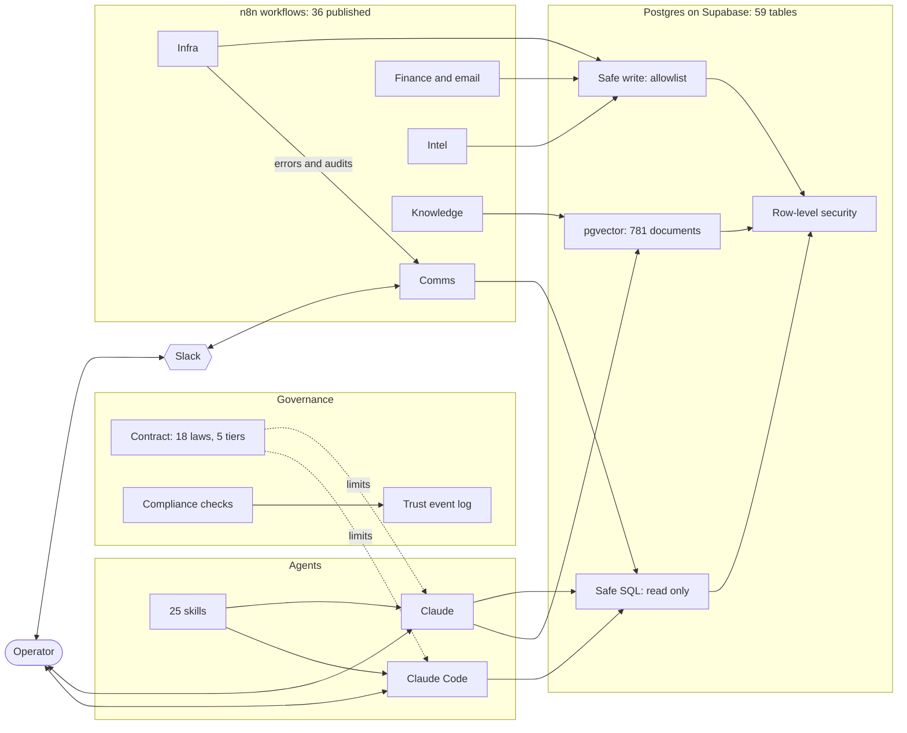

# Architecture

How the system fits together. Every box below is a real component with files in one of the repos.

## The system map

## How to read it

**The operator sits at the top.** Everything the system does either follows a rule the operator wrote or waits for the operator to say yes. Slack is the side door for quick commands. A working session with Claude or Claude Code is the front door.

**Governance limits the agents.** The [contract](https://github.com/MrMinor-dev/security-governance-framework/blob/main/GOVERNANCE-CONTRACT.md) sorts every action into 5 tiers: forbidden, human-only, approval required, inform after, autonomous. The dotted lines in the map are those limits.

**Skills tell the agents how.** A skill is a Markdown file with a version number. The agent reads it before it does the job, so the procedure is the same each time. [25 skills](CATALOG.md#skills) cover sessions, workflows, documents, search, and delegation.

**Workflows do the repeating work.** n8n runs [36 published workflows](CATALOG.md#workflows) in 7 groups. Each one logs to the same health table, so a failure in any of them ends up in the same place.

**The database is the only shared state.** Every table has row-level security on. The agent reads through a service that allows SELECT and nothing else. It writes through a service that checks a table and column allowlist. Details are in the [database security repo](https://github.com/MrMinor-dev/database-security-framework).

## Walk-through 1: an email becomes a budget alert

1. A message arrives in Gmail. The [Email Router](https://github.com/MrMinor-dev/back-office-automation) matches the sender against domain lists, labels it, and files it. No AI call is involved.
2. Each morning the [Invoice Handler](https://github.com/MrMinor-dev/back-office-automation) picks up messages labeled as financial, pulls out the vendor, amount and dates, and writes an expense row.
3. The [Budget Monitor](https://github.com/MrMinor-dev/back-office-automation) compares the month so far against budget. It checks its own alert history first, so the same breach doesn't alert twice.
4. The [Daily Digest](https://github.com/MrMinor-dev/n8n-development-framework) folds the expense summary into one Slack message.

The agent has $0 of spending authority. It records, categorizes, and alerts. Anything that moves money stops and waits for the operator.

## Walk-through 2: an error becomes a remediation prompt

1. Any workflow that fails triggers its Error Trigger node. That node writes a row with state `error` to the shared health table.
2. The [Remediation Trigger](https://github.com/MrMinor-dev/n8n-development-framework) counts errors per workflow over 24 hours. It also looks for workflows that should have reported and didn't, which catches silent failures.
3. Past a threshold, it drafts a remediation prompt as a file for Claude Code to work from.
4. The Daily Digest lists pending remediations. The operator approves the fix.
5. The [Weekly Audit](https://github.com/MrMinor-dev/n8n-development-framework) checks liveness, coverage, naming, database security and registry gaps, so problems that never raised an error still surface.

## Where each layer lives

| Layer | What it holds | Repo |
|---|---|---|
| Rules | Contract, tiers, compliance | [security-governance-framework](https://github.com/MrMinor-dev/security-governance-framework) |
| Procedures | Skills | [ai-skills-framework](https://github.com/MrMinor-dev/ai-skills-framework) |
| Execution | Workflows | [n8n-development-framework](https://github.com/MrMinor-dev/n8n-development-framework), [back-office-automation](https://github.com/MrMinor-dev/back-office-automation) |
| State | Tables, policies, allowlists | [database-security-framework](https://github.com/MrMinor-dev/database-security-framework) |
| Memory | Search over documents | [rag-knowledge-base](https://github.com/MrMinor-dev/rag-knowledge-base) |
| Working relationship | State document, handoffs, async commands | [human-ai-coordination-framework](https://github.com/MrMinor-dev/human-ai-coordination-framework) |
| Tooling | MCP server installs | [mcp-server-installation-framework](https://github.com/MrMinor-dev/mcp-server-installation-framework) |

## What is running and what is design

The tiers, the skills, the workflows, the database controls and the search index run today. The trust event log is in use but small, and the calibration model built on top of it is mostly design. The [governance README](https://github.com/MrMinor-dev/security-governance-framework) says which is which.
